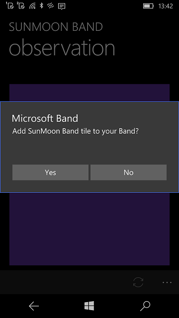
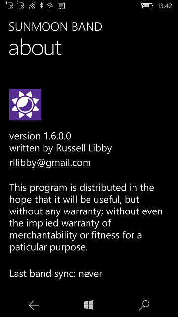

# SunMoonBand

SunMoonBand :: UWP (W10M) "reburn" (my fork& remake).

## Screenshots

## About the original

"Get daily sun and moon data for your location sent to your Microsoft Band. 
The custom band tile displays sunrise, sunset, moonrise, moonset and current moon phase 
as well as illumination percentage. All data provided by the US Naval Observatory."

- Russell Libby, SunMoonBand for WP8

## My 2 cents

- Researching of original WP8 code;
- Code transformation into W10M ver. (Min. os build: 15041... but 14393 with NP));
- Minimal UI testing :)

## Problems / Bugs

Sunset services obsolete (destroyed?). Fresh data sources wanted :)

## DIY

Let some Weather service to bring cool Sunrize/Sunset time data for this little small thing.. =)

## Author

Russell Libby (https://github.com/rllibby)

## ..

AS IS. No support. RnD only!

## .

[m][e] 2022